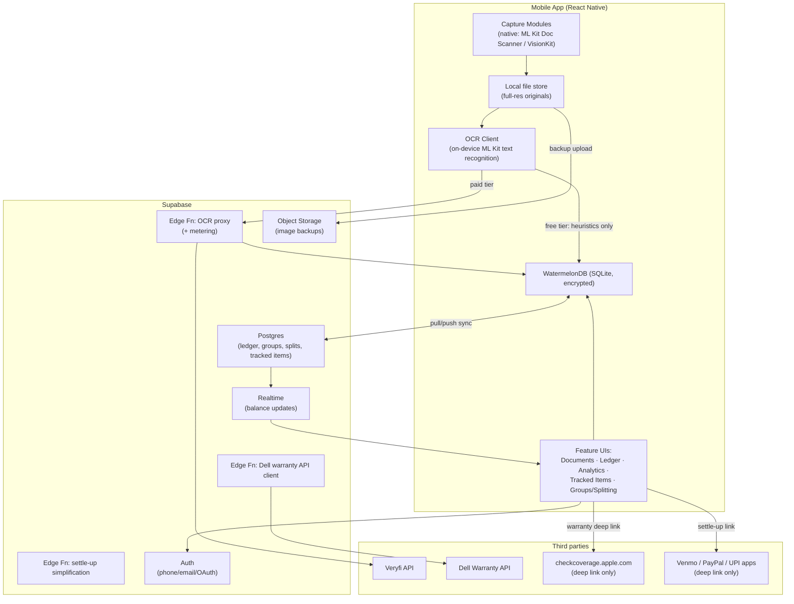

# Document Tracker — Architecture & Technical Design

Status: **Design phase (Phase 0)** — no application code yet. This document turns the
product spec into concrete technical decisions so implementation (starting with
Android, per the build order) can begin without re-litigating architecture mid-build.

## 1. Guiding principles → concrete consequences

The product brief sets several architecture principles. This section states what each
one *forces us to decide*, not just what it says.

| Principle | Consequence |
|---|---|
| OCR is buy-not-build | We call a vendor API for structured extraction; we never train/host a model. |
| No single scanning SDK covers both platforms | Capture is isolated behind a native-module interface; JS/business logic never touches camera APIs directly. |
| One cross-platform framework | All non-capture code (data, sync, analytics, splitting, UI) is one codebase. |
| Local-first | The on-device DB is the source of truth for reads; cloud is a replica used for backup + multi-device + multi-user (splitting). The app must be fully usable offline except for splitting (needs other members). |
| Encrypt incidental account/card numbers | Specific fields (serial/IMEI, loyalty/gift-card account numbers), not whole rows, are encrypted — so search/filter on non-sensitive fields stays fast. |
| Meter OCR from day one | Every extraction call — on-device or cloud — is logged against a per-user quota *before* the app ever ships a paid tier, so enabling billing later is a config flip, not a rebuild. |
| Generic "tracked item" shape | Warranty and Loyalty are one table/model with a `type` discriminator, not two parallel schemas. |
| Deep-link settle-up only | We never touch money. No PCI scope, no money-transmitter licensing. |
| No scraping | Warranty/loyalty lookups either use a documented API, or deep-link to the vendor's own page. This is a hard rule, not a fallback of convenience. |

## 2. Tech stack decisions

| Layer | Choice | Why | Alternative considered |
|---|---|---|---|
| App framework | **React Native + TypeScript** | Largest ecosystem for the specific integrations this app needs (deep-linking, Firebase, Supabase JS client); best-supported local-first DB library (WatermelonDB) targets RN specifically. | Flutter — equally valid; weaker offline-first DB story (Drift/Isar are less battle-tested for this exact sync pattern). |
| Document capture | **Two thin native modules wrapping each platform's free OS-level document scanner**: Android → ML Kit Document Scanner API (Google Play Services); iOS → VisionKit `VNDocumentCameraViewController`. Both do edge detection, perspective correction, and multi-page capture natively, at zero SDK cost. | Satisfies "two native camera modules" at $0 marginal cost, maintained by the platform vendor, and Android-first fits our build order since ML Kit's scanner ships as a Play Services module today. | Paid cross-platform SDK (Scanbot-class) — revisit only if we need a fully custom capture UI or must support devices without Play Services (see §12 risks). |
| OCR / field extraction | **Veryfi** for Bills & Receipts (purpose-built schema: vendor, tax, total, date — plus ready-made line-item extraction for the deferred itemization phase). **On-device ML Kit Text Recognition + our own field parser** for Warranty & Loyalty documents. | No commercial vendor sells "warranty card" or "loyalty card" structured extraction — those aren't a standardized document type the way receipts are. For those categories we buy raw text OCR and build a thin regex/heuristic layer (dates, IMEI/serial patterns, currency amounts) ourselves. | Mindee/Taggun — comparable receipt vendors, keep as a swap-in behind the same interface if Veryfi pricing/coverage disappoints. |
| Local DB | **WatermelonDB** (SQLite-backed, reactive, built specifically for offline-first RN apps with a bring-your-own sync endpoint) | Matches "local-first, cloud is backup" directly; reactive queries drive dashboards without a separate cache layer. | Realm — has built-in sync, but MongoDB is retiring Atlas Device Sync; ruled out. |
| Local DB encryption | SQLCipher-backed SQLite file; DB key stored in Android Keystore / iOS Keychain. | Whole-device-loss protection independent of field-level encryption (§6). | — |
| Backend | **Supabase** (Postgres + Auth + Storage + Realtime + Edge Functions) | Postgres fits the relational ledger/splitting data; built-in Realtime (via Postgres logical replication) is exactly what live split balances need; Storage covers image backup; Auth covers phone/email/link invites out of the box. Net effect: buy-not-build applied to our own backend, same philosophy as the OCR call. | Fully custom Node/Postgres/Redis — fall back to this only if enterprise data-residency requirements surface later; nothing in this design is Supabase-proprietary at the data-model level, so migration stays possible. |
| Server-side logic | **Supabase Edge Functions (Deno/TS)** for: OCR proxy, Dell warranty API client, settle-up simplification, push notification dispatch. | Keeps vendor API keys and OAuth secrets server-side; is also the natural metering choke point. | — |
| Push notifications | FCM (Android first), APNs added in the iOS parity phase. | | |
| Object storage | Supabase Storage (S3-compatible), private buckets, signed URLs. | Cloud copy of originals for backup/multi-device — never the only copy (local-first principle). | |

## 3. System architecture



Key property: every arrow into `ThirdParty` either goes through our own Edge Function
(so we hold the credentials and can meter/log it) or is a `Linking.openURL` deep link
the OS hands off to another app — the client never embeds a third-party API key, and
never scrapes a third-party page.

## 4. Capture → OCR pipeline

1. **Capture**: native module returns one or more perspective-corrected page images
   for a single document.
2. **Local save**: images written to app-private storage immediately (local-first —
   the scan is never lost even if everything past this point fails).
3. **Hashing**: compute a perceptual hash (pHash) per page and a fuzzy key
   (normalized vendor + date + amount, filled in after OCR) — see §9 duplicate
   detection.
4. **Duplicate check**: compare pHash (Hamming distance ≤ 8) against recent
   documents; if OCR has already run, also fuzzy-match vendor/date/amount. A hit
   surfaces a non-blocking "possible duplicate" choice at review time — it never
   silently blocks a save.
5. **OCR**:
   - *Free tier*: on-device text recognition only; our field parser guesses
     category + fields from raw text (lower accuracy, expected).
   - *Paid tier / after free quota*: image sent to the Edge Function proxy, which
     calls Veryfi (Bills & Receipts) or Cloud Vision/Document AI (Warranty/Loyalty),
     logs the call against the user's OCR usage quota, and returns structured
     fields.
6. **Auto-categorize**: into Bills & Receipts / Warranty / Loyalty / Other, based on
   vendor/keyword heuristics + OCR vendor's own document-type signal where available.
7. **Review & edit UI**: every extracted field is editable; category is one-tap
   reassignable. This is the only step that writes the final `Document` +
   category-specific record — nothing upstream is a "silent" auto-commit.
8. **Sync**: WatermelonDB queues the change; sync adapter pushes to Postgres and
   uploads originals to Storage in the background.

## 5. Data model

See [`DATA_MODEL.md`](./DATA_MODEL.md) for full field-level schemas. Summary of the
key structural decision:

- `Document` is the one row every feature reads from (capture metadata, image
  refs, OCR raw text, hashes). It is never duplicated per feature.
- `BillReceipt` is a 1:1 typed extension of `Document` for the ledger.
- `TrackedItem` is the **single generic model for both Warranty and Loyalty**,
  distinguished by a `type` column (`warranty_device | loyalty_program |
  gift_card`), with a shared `expiry_or_renewal_trigger` + `reminder_rule` shape and
  a `type_specific_data` JSON column for the handful of fields that genuinely differ
  (e.g., warranty verification status vs. points balance). Adding a 5th tracked-item
  type later (should the product ever want one) means adding a `type` value and a
  JSON shape, not a new table + new dashboard + new reminder engine.
- `Expense`/`SettleUp`/`Group` model splitting; `Expense.source_document_id` is how
  "split from an existing Bills & Receipts entry" is represented — it's the same
  document, not a copy.

## 6. Security & encryption

- **Field-level encryption** (AES-256-GCM, envelope-encrypted under a server-side
  KMS key) applies specifically to: `TrackedItem.identifier` (serial/IMEI/loyalty or
  gift-card account number). Non-sensitive fields (vendor, dates, amounts, category)
  stay in plaintext columns so they remain indexable/searchable.
- **At rest, locally**: SQLCipher-encrypted SQLite; key in Keystore/Keychain, never
  synced or backed up as plaintext.
- **At rest, cloud**: Postgres storage-level encryption (Supabase default) plus the
  application-layer encryption above for identifier fields specifically — belt and
  suspenders on the one field class the spec calls out as sensitive.
- **In transit**: TLS to Supabase and to the OCR proxy; the client never talks to
  Veryfi/Vision/Dell directly.
- **Images**: local originals in app-private storage; cloud backups in a private
  bucket behind short-lived signed URLs, never a public bucket.

## 7. OCR metering

A per-user `ocr_usage` ledger (month, `scans_on_device`, `scans_cloud`, `plan_tier`)
is written on *every* extraction, starting with the very first build — including
while the app is 100% free — so that:
- the free/paid boundary is a quota check + plan flag, not new plumbing;
- we have real cost data before ever pricing a paid tier.
The Edge Function proxy is the only thing allowed to call Veryfi/Vision — this is
also the metering choke point (client-side metering can't be trusted; a call from
an unmodified client is the only call that counts).

## 8. Feature → module mapping

| Feature | Mobile modules | Backend pieces |
|---|---|---|
| 1. Capture & Document Engine | `capture/` (native bridges), `ocr/` (vendor abstraction + on-device fallback + field parser), `documents/` (CRUD, FTS5 search index, dedup) | OCR proxy Edge Fn, Storage |
| 2. Spend Analysis | `ledger/`, `analytics/` (aggregations + charts), `budgets/`, `export/` (CSV/PDF + image bundling) | none beyond sync (all analysis can run off the local replica) |
| 3. Expense Splitting | `groups/`, `splitting/` (split-type calculators), `settleup/` (per-provider deep-link builders) | Postgres (groups/expenses/splits), Realtime (balances), settle-up simplification Edge Fn, invite delivery (SMS/email via Supabase Auth or a transactional email provider) |
| 4. Warranty/Device/Loyalty | `trackeditems/` (generic CRUD + Active/Expiring/Expired status engine), `warrantyverification/` (tiered strategy, §9), `reminders/` (local notif scheduling + push) | Dell API Edge Fn, lookup-table admin data |

## 9. Duplicate detection

- **Same physical document rescanned**: perceptual hash (pHash) per page computed
  at capture time; Hamming distance below a threshold against any existing
  document's pages flags a likely rescan.
- **Same purchase logged twice from different photos**: fuzzy match on normalized
  vendor name (Jaro-Winkler similarity ≥ 0.85) + date (±1 day) + amount (exact or
  ±$0.01), computed after OCR completes.
- Both checks are advisory, surfaced once at the review/edit step ("this looks like
  a document you already have — keep both / merge / view existing"), never a hard
  block.

## 10. Warranty verification (tiered strategy)

Implemented as a small strategy chain tried in order, stopping at the first tier
that applies:

1. **Documented manufacturer API** (small allowlist, e.g. Dell Warranty Management
   API) — server-side only, since it holds an OAuth2 client secret. Auto-populates
   the result.
2. **Public warranty-check page, no API** (e.g. Apple checkcoverage.apple.com) — the
   client deep-links to the manufacturer's own page, pre-filling the identifier via
   URL parameters where the page documents support for that; otherwise deep-links to
   the bare page and lets the user paste the identifier. We never scrape this page.
3. **Everything else** — editable category/brand lookup table suggests a typical
   duration; user confirms or adjusts.

Fallback is always available at every tier: manual entry overrides any of the above.

## 11. Settle-up deep links

| Provider | Link | Platform notes |
|---|---|---|
| Venmo | `venmo://paycharge?txn=pay&recipients={username}&amount={amount}&note={note}` | Requires the counterparty's Venmo username on file. |
| PayPal | `https://paypal.me/{username}/{amount}` | Opens the PayPal app if installed, else web — no API key. |
| UPI | `upi://pay?pa={vpa}&pn={name}&am={amount}&cu=INR&tn={note}` | OS-level intent on Android, resolves to whichever UPI apps are installed. **iOS has no unified UPI scheme** — each UPI app (GPay, PhonePe, Paytm, …) defines its own custom scheme, so iOS support is a small per-app registry built out during the iOS parity phase, not part of the Android-first build. |

Settle-up suggestions themselves (which pairs of members should pay whom) use
standard debt simplification: net each member's balance across the group, then
greedily settle the largest creditor against the largest debtor until all balances
are zero. Runs server-side (Edge Function) on every expense/settlement change;
result is pushed to all members over Realtime.

## 12. Repo structure (target, once implementation starts)

```
/apps
  /mobile                     React Native app
    /src
      /capture                native module bridges (Android first, iOS stub)
      /ocr                    vendor client + on-device fallback + field parser
      /documents               Document CRUD, search, dedup
      /ledger
      /analytics
      /budgets
      /export
      /trackeditems            generic tracked-item CRUD + status engine
      /warrantyverification    tiered strategy chain
      /reminders
      /groups
      /splitting
      /settleup
      /db                     WatermelonDB schema + models + sync adapter
      /navigation
      /components
  /backend
    /functions
      /ocr-proxy
      /warranty-dell
      /settle-suggestions
      /invites
    /migrations                Postgres schema
/docs
  ARCHITECTURE.md              this file
  DATA_MODEL.md
```

## 13. Phased roadmap (Android-first)

| Phase | Scope | Notes |
|---|---|---|
| 0 (this doc) | Architecture + data model, no code | |
| 1 | Capture engine (Android) + OCR pipeline + minimal auto-populated ledger | ML Kit Doc Scanner, Veryfi integration, on-device fallback, Documents list/search/dedup |
| 2 | Warranty/Device/Loyalty tracking | Generic `TrackedItem`, lookup tables, status dashboard, reminders, tiered verification incl. Dell API + Apple deep link |
| 3 | Full spend analysis | Dashboards, trend/YoY/MoM, budgets + alerts, CSV/PDF export bundling originals |
| 4 | Expense splitting | Groups, all split types, Realtime balances, settle-up deep links (Venmo/PayPal/UPI-Android) |
| 5 | iOS parity | VisionKit capture bridge, APNs, per-app iOS UPI scheme registry |

Each phase after Phase 1 reuses the same data model and backend — per the product
brief, splitting is the only feature that needed the multi-user/realtime backend, and
that's already in place by Phase 1 (Supabase), so Phase 4 is additive, not a
migration.

## 14. Open questions / risks to validate during implementation

- Whether `checkcoverage.apple.com` actually documents a URL parameter for
  pre-filling the serial number, or only accepts manual entry once loaded — affects
  how much of a "one tap" experience §10 tier 2 really is for Apple specifically.
  Confirm at implementation time; degrade gracefully to a bare deep link either way.
- Devices without Google Play Services (some Android OEMs/regions) can't use ML Kit
  Document Scanner — needs a fallback capture path (custom camera + manual crop, or
  the paid-SDK alternative from §2) before Android capture is considered fully done,
  not just "done for Play-Services devices."
- Veryfi (or chosen vendor) pricing at expected scan volume — confirms whether the
  free/paid OCR tier split in §7 lands at a sustainable price point.
- Data residency requirements, if any, for a Deloitte-affiliated deployment — the
  data model has no Supabase-proprietary shape, so a self-hosted Postgres swap stays
  possible, but worth confirming before Phase 1 if this is going beyond a personal
  project.
